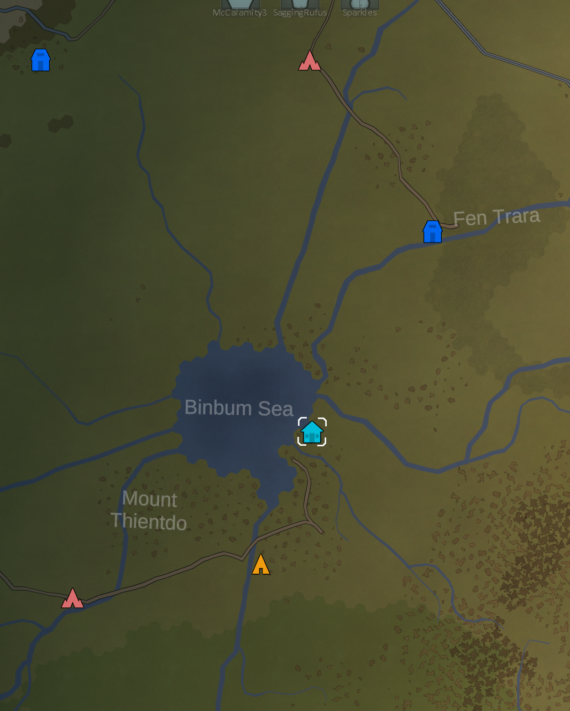
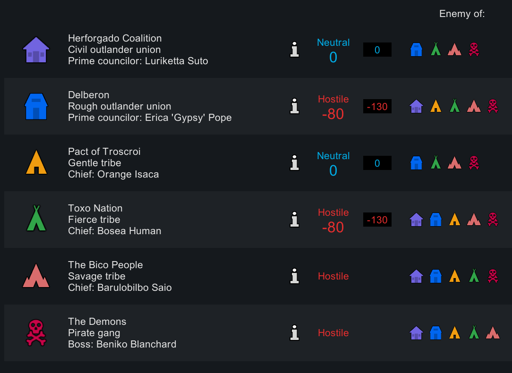
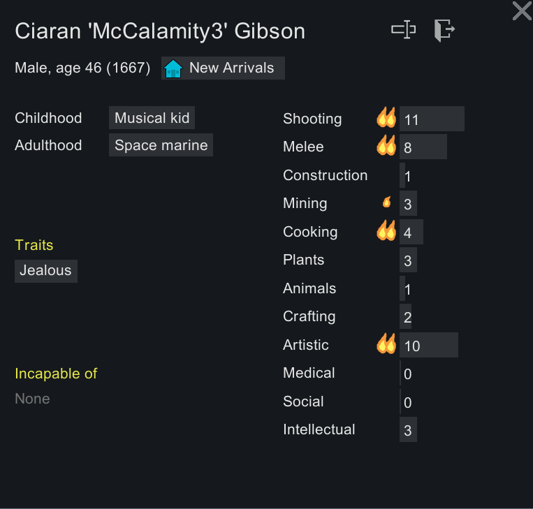
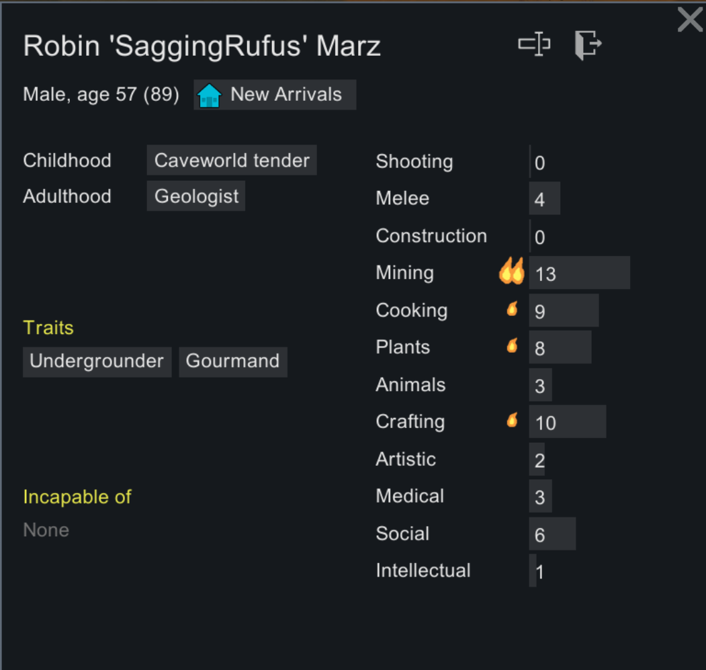
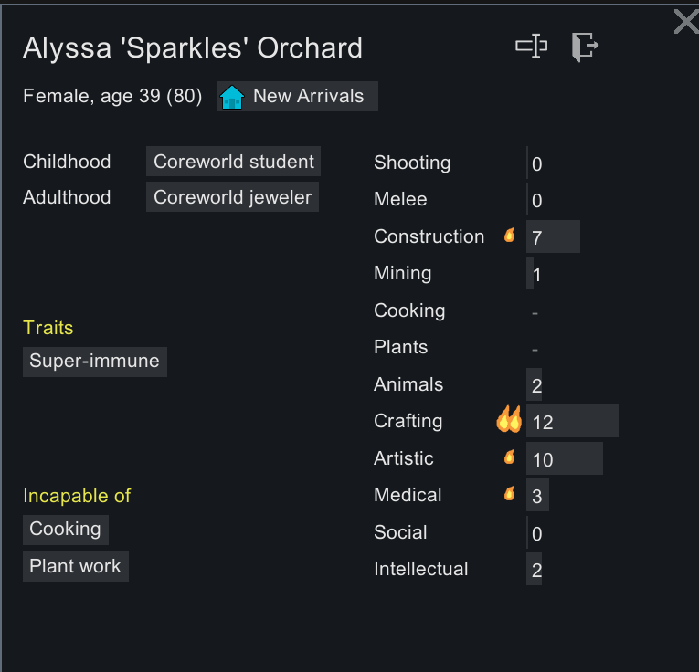

# Chronovail
## Table of Contents
- [Background](#background)
   - [What Is Chronovail?](#what-is-chronovail)
   - [The Captain](#the-captain)
   - [The Multiverse](#the-multiverse)
   - [Video Blog](#video-blog)
- [The World](#the-world)
   - [World Generation Settings](#world-general-settings-settings)
   - [Where is Chronovail?](#where-is-chronovail)
   - [Which Factions Exist?](#which-factions-exist)
   - [Who Are The Founding Colonists](#who-are-the-founding-colonists)
- [How Do I Participate?](#how-do-i-participate)
   - [Mods and Expansions](#mods-and-expansions)
- [Understanding This Repo](#understanding-this-repo)
   - [Timelines](#timelines)
      - [Chronovail-Prime](#chronovail-prime)
      - [Diverging Timelines](#diverging-timelines)
   - [Git Branches](#git-branches)
   - [Universal Date and Time](#universal-date-and-time)
   - [Git Tags](#git-tags)
   - [Releases](#releases)

---

## Background
### What Is Chronovail?
**Chronovail** is a unique multiplayer [RimWorld](https://store.steampowered.com/app/294100/RimWorld/) playthrough where leadership is passed on through multiple players, each taking charge of the settlement one at a time.

### The Captain
The ruler of Chronovail is known as **The Captain**, an overseer who has full control over all decisions, and shaping the colony as they see fit. Each Captain captain must follow basic laws that are defined in a readme file. One example is keeping a captains log. In these logs, a Captain will documents their plans and goals they hope complete before the end of the year, they must also document significant events that happen during their reign.  

### The Multiverse
Chronovail exists in multiple timelines. If the Colony should fail, this would cause a timeline divergency. Additional timelines can also be made by Discord members by pick up old versions of the save file and creating alternate timelines of Chronovail. For example, if the prime timeline reaches five in-game years, a community member could choose to start a timeline divergence starting from year two, creating a parallel history where events diverge and new destinies unfold.

### Video Blog
You can find a living video journal of Chronovail on our youtube channel [Dungeons And Downloads](https://www.youtube.com/channel/UCD6wWAvexilyjzzJq29nRyQ). 

---
## The World
### World General Settings Settings
The world of Chronovail was created using the following settings:

- Scenario: Crashlanded
- Story Teller: Randy Random
- Difficulty: Adventure Story
- Save Mode: Commitment Mode
- Seed: `chronovail1746915815`
- Globe Coverage: 30%
- Overall rainfall: Normal
- Overall temperature: Normal
- Population: Normal

The initial creation of the world was done with no mods or DLC enabled.

### Where Is Chronovail?
To the east of the Binbum Sea, and north-east of Mount Thientdo one can find the settlement of Chronovail. 

### Which Factions Exist?
Most of the pre-existing factions in this world are hostile to Chronovail

The only nations we can trust are the Herforgado Coalition, and the Pact of Troscroi.

### Who Are The Founding Colonists?
#### McCalamity

#### SaggingRufus

#### Sparkles

---

## How Do I Participate?
To officially participate in the Chronovail experience, you must join [The Captain's Lounge](http://discord.gg/ZeAN6Vn84T), our community discord.

### Mods and Expansions
There are plans to potentially add mods and expansions in the future. As timelines progress, mods and expansions may be added, but every timeline could be different in that regard. The main README file of the timeline will clearly state the pre-requisites required to play or contribute to the timeline.  

---

## Understanding This Repo
This is not traditional git repo. Most tenants of git are used improperly in this project, git is just a tool being used to track the multiple universes and captain's logs in a semi-sane way. This repo is organized in very specific way. Branch and Tag names have significance.

**Note:** There is no obligation to use git. If you want to participate in Chronovail, all submissions are done via discord. The explanation of this repo is just to help people navigate the multi-verse and the history of Chronovail.

### Timelines
#### Chronovail-Prime
Every timeline in Chronovail follows the same naming standing with the exception of the original timeline. The full name of the original timeline is Chronovail-Prime (aka cp0 or prime).

#### Diverging Timelines
Diverging timelines in Chronovail all following the same naming pattern 
`CP#-X%-..` 

|Placeholder|Definition|
|---|---|
|CP|Chronovail-Prime|
|#|Year of divergence from Prime|
|X|Divergence letter identifier (next alphabetic)
|%|Year of divergence from x, 0 denotes a new divergence leaf|

##### Examples
|Name|Description|
|---|---|
|CP0|Chronovail-Prime, the original timeline|
|CP5-A0| Diverged from CP0 on year 5, this is where the CP5-A timeline starts|
|CP7-A5-B0| The first divergence from CP0 was on year 7. Because the next divergence resulted in a B, we can tell this is the second divergence and happened during year 5 of CP7-A0|

### Git Branches
This branch (main) is used only as welcome page, all other branches are used for timeline tracking. Each branch in this repo represents a specific timeline. All of the branches and timelines follow the same naming standard. The branch name is always `timeline/` followed by the timeline name.

#### Examples
|Timeline|Branch|
|---|---|
|CP0|`timeline/cp0`|
|CP5-A2-B0|`timeline/cp5-a2-b0`|

### Universal Date And Time
Because Chronovail takes place in a multiverse, knowing the date isn't quite enough to know when someone is talking about. If you are just referencing a generic date that is not timeline specific, you may just reference the date. 

This [RimWorld Wiki page](https://rimworldwiki.com/wiki/Time#In-game_time) explains the in-game calendar. When making reference to a specific timeline date, you first include the timeline, an replace the final 0 with the year, and then first letter of the quandrum followed by the date. For example, if I was referencing the year 5555 on the 10th day of Septober in timeline CP5-A2-B0, the full date would be CP5-A2-B5555S10. If for you some reason you need to specify time, that would change to CP5-A2-B5555S10T02.

### Git Tags
At the beginning of each in-game year, the file is committed to the repo before it is passed on to the next captain. Each tag be the universal date a the time of the save. That means that Chronovail-Prime at the beginning of year 5555 would be CP5555. Using that same year, the timeline CP5-A2-B0 would be tagged with CP5-A2-B5555.

### Releases
At the end of every era on cp0, there will be a Release on github. The release notes will be an end of era report completed by the captain. 